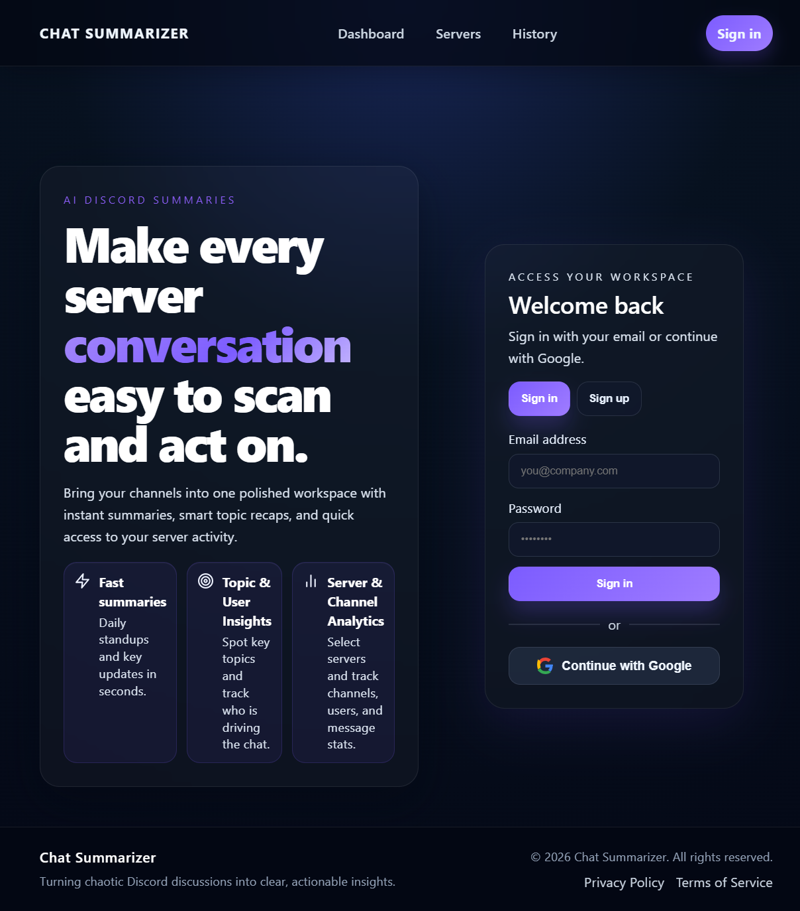
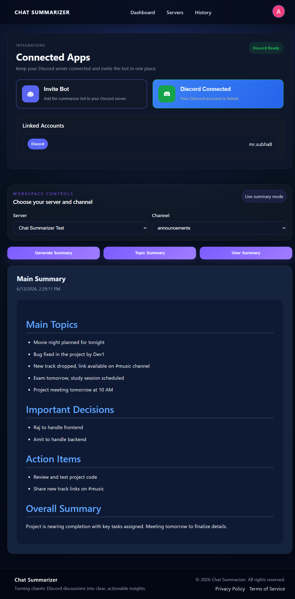
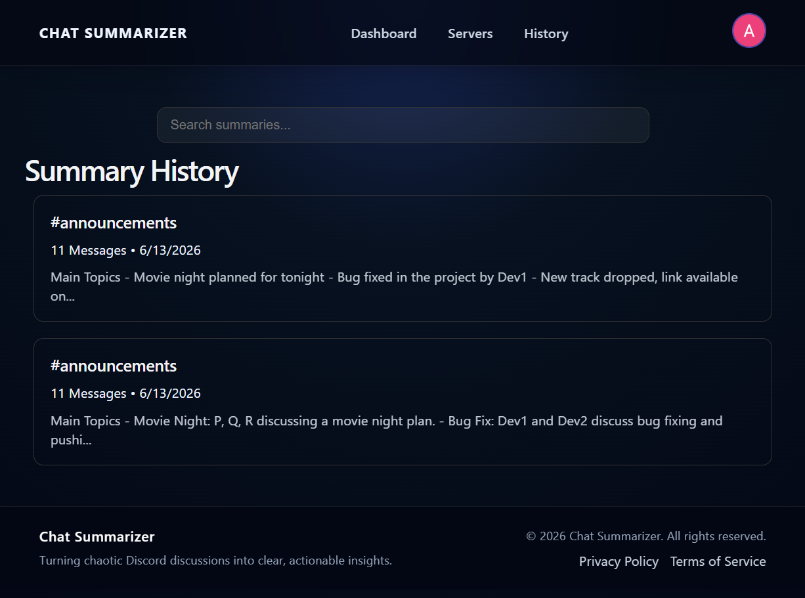
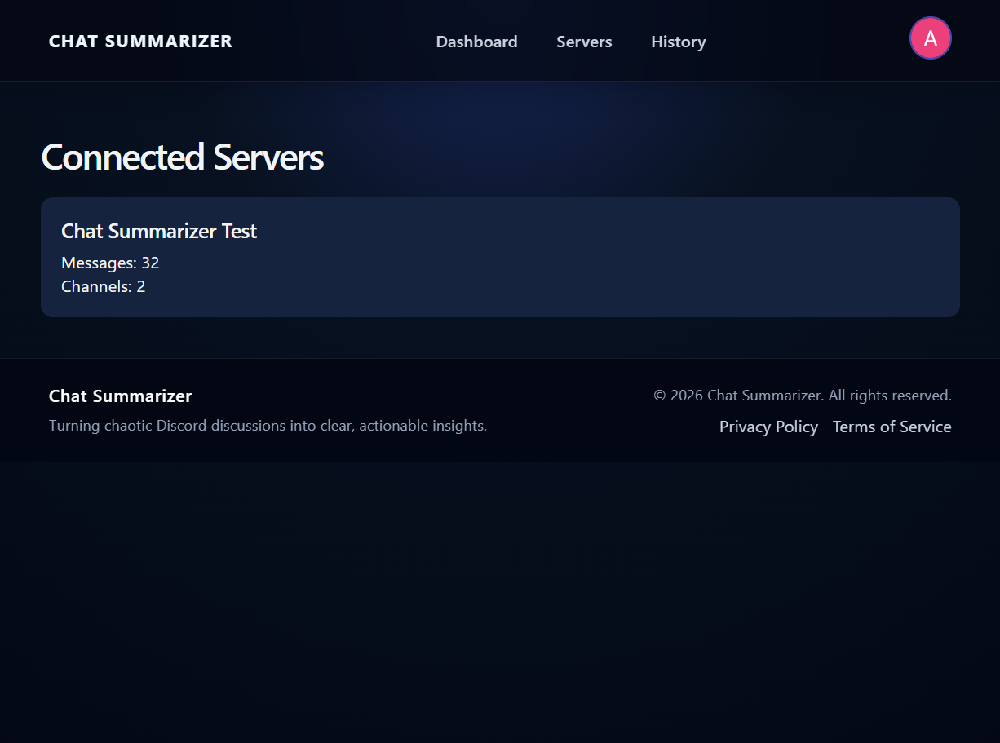

# Chat Summarizer

AI-powered Discord conversation summarization platform built with the MERN stack and Ollama.

## 📸 Screenshots

### Landing Page


### Dashboard


### Summary History


### Server Details


## 🚀 Overview

Chat Summarizer helps users quickly understand long Discord conversations without reading hundreds of messages.

### Key Features

- Google & Discord OAuth Authentication
- Discord Bot Integration
- AI-powered Chat Summaries
- Topic-wise Summaries
- User Contribution Analysis
- Summary History
- Server & Channel Selection

## 🛠 Tech Stack

**Frontend**
- React
- React Router
- Axios

**Backend**
- Node.js
- Express.js
- Passport.js

**Database**
- MongoDB

**AI**
- Ollama (Llama 3)

**Discord**
- Discord OAuth2
- discord.js

## ⚙️ Installation

```bash
git clone <repo-url>

cd backend
npm install

cd ../frontend
npm install

cd ../bot
npm install
```

## 🔮 Future Features

- Telegram Integration
- Slack Integration
- WhatsApp Integration
- AI Assistant
- Real-Time Summaries

## 👨‍💻 Author

**Subha Bera**

B.Tech CSE (AI & ML)
